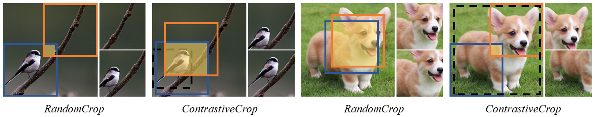

## Crafting Better Contrastive Views for Siamese Representation Learning (CVPR 2022 Oral)

 

**2022-03-29**: The paper was accepted as **CVPR 2022 Oral** paper!

**2022-03-03**: The paper was accepted by **CVPR 2022**!

This is the official PyTorch implementation of the [ContrastiveCrop paper](https://arxiv.org/abs/2202.03278):
```
@article{peng2022crafting,
  title={Crafting Better Contrastive Views for Siamese Representation Learning},
  author={Peng, Xiangyu and Wang, Kai and Zhu, Zheng and You, Yang},
  journal={arXiv preprint arXiv:2202.03278},
  year={2022}
}
```
This repo includes PyTorch implementation of SimCLR, MoCo, BYOL and SimSiam, as well as their DDP training code.
## Preparation
1. Create a python enviroment with `pytorch >= 1.8.1`.
2. `pip install -r requirements.txt`
3. Modify dataset `root` in the config file.

## Pre-train
```
# MoCo, CIFAR-10
python DDP_moco_ccrop.py configs/small/cifar10/moco_alpha0.1_th0.1.py

# SimSiam, CIFAR-100
python DDP_simsiam_ccrop.py configs/small/cifar100/simsiam_alpha0.1_th0.1.py
```
## Linear Evaluation
```
# CIFAR-10
python DDP_linear.py configs/linear/cifar10_res18.py --load ./checkpoints/small/cifar10/moco_alpha0.1_th0.1/last.pth

# CIFAR-100
python DDP_linear.py configs/linear/cifar100_res18.py --load ./checkpoints/small/cifar100/simsiam_alpha0.1_th0.1/last.pth
```

More models and datasets coming soon.
